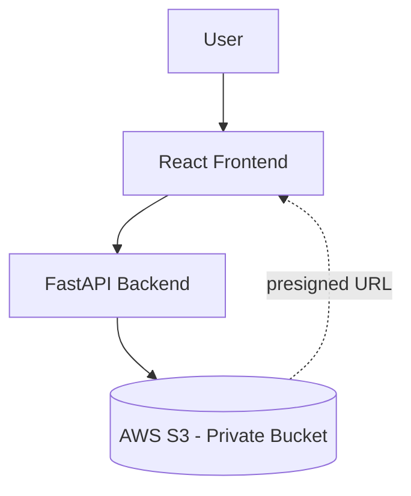
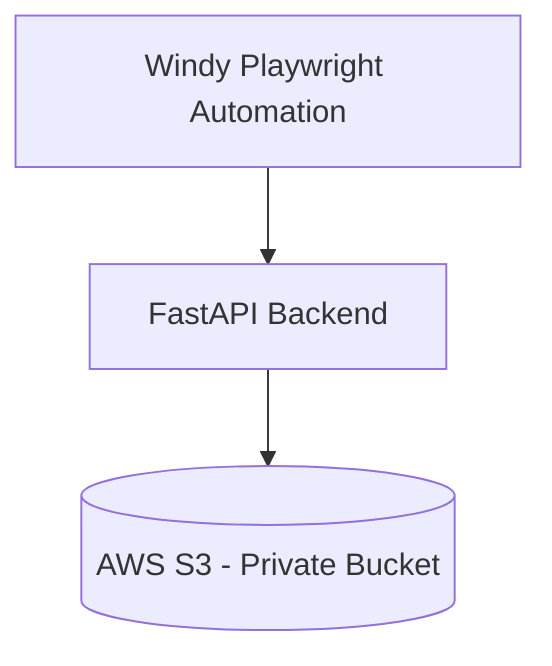
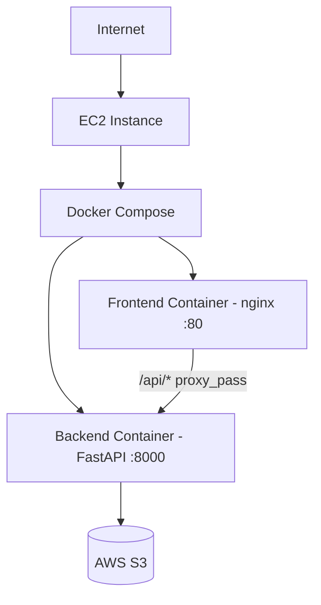
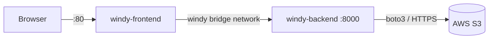
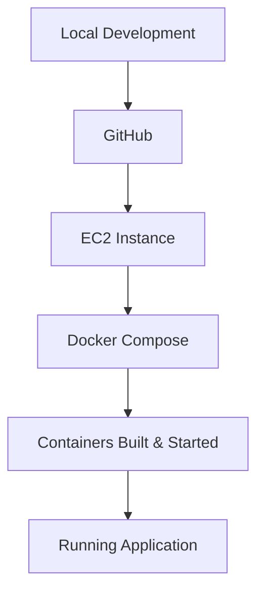
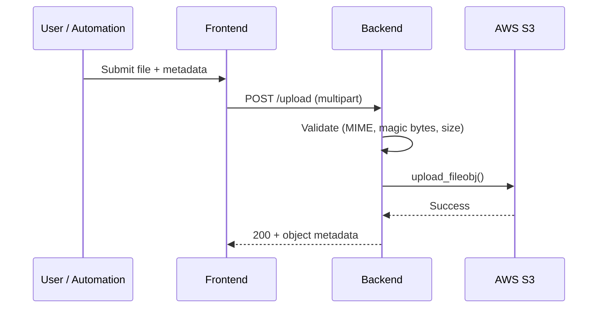

# Windy Video & Document Manager

### AWS Infrastructure & Deployment Document

| | |
|---|---|
| **Document Type** | Cloud Architecture & Deployment Guide |
| **Version** | 1.0 |
| **Status** | Final |
| **Prepared By** | Cloud Solutions Architecture Team |
| **Company Submission** | Internal Engineering — Deployment Review |

---

## Table of Contents

1. Executive Summary
2. AWS Services Used
3. Cloud Architecture
4. EC2 Configuration
5. Security Group Configuration
6. IAM Configuration
7. S3 Configuration
8. S3 Object Structure
9. Docker Architecture
10. Deployment Process
11. Environment Variables
12. Application Workflow
13. Security Considerations
14. Testing & Validation
15. Deployment Screenshots
16. Future Improvements
17. Conclusion

---

## 1. Executive Summary

Windy Video & Document Manager is a three-part system deployed on AWS infrastructure:

1. **Windy Playwright Automation** — a headless Chromium process that records short weather videos from Windy.com and uploads them via HTTP.
2. **FastAPI Backend** — validates every upload, builds a structured object key, and stores the asset in Amazon S3 using boto3.
3. **React Frontend** — a dashboard for browsing, filtering, uploading, previewing, and downloading videos and documents.

The application is containerized with **Docker** and orchestrated with **Docker Compose**, targeting deployment on a single **AWS EC2** instance. **Amazon S3** is the sole persistence layer — there is no relational database. All object metadata (state, plant, date, time) is encoded in the S3 object key and derived at read time. Access to stored assets is granted exclusively through **presigned URLs**; the bucket itself remains fully private.

---

## 2. AWS Services Used

| Service | Purpose in This Project |
|---|---|
| **Amazon EC2** | Hosts the Docker Compose stack (frontend + backend containers) as the production compute target. |
| **Amazon S3** | Sole storage layer for videos and documents. Private bucket, structured key hierarchy, no database required. |
| **IAM** | Issues scoped credentials the backend uses to call S3 (list, get, put) via the boto3 credential provider chain. |
| **Security Groups** | Instance-level firewall controlling inbound access to the EC2 host (SSH, HTTP, backend port). |
| **Elastic IP** *(recommended)* | Provides a stable public IP for the EC2 instance so DNS/bookmarks survive instance stop/start. |
| **Docker** | Packages the backend (Python/FastAPI) and frontend (React/nginx) as reproducible, isolated images. |
| **Docker Compose** | Orchestrates both containers as a single stack with one command, wires the shared network, and enforces startup ordering via health checks. |
| **Nginx** | Serves the compiled frontend and reverse-proxies `/api/*` to the backend container — same-origin, no CORS, no hardcoded backend URL. |

---

## 3. Cloud Architecture

### 3.1 Diagram 1 — User Read/Write Path



### 3.2 Diagram 2 — Automation Ingestion Path



### 3.3 Diagram 3 — EC2 Deployment Topology



---

## 4. EC2 Configuration

> The specification below is the **standard target configuration** for this deployment, applied consistently across environments. Provision the instance according to this table before running Docker Compose.

| Setting | Value | Rationale |
|---|---|---|
| **Instance Type** | `t3.medium` (2 vCPU / 4 GB RAM) | Runs both containers comfortably; `t3.micro`/`t2.micro` are undersized for concurrent build + serve workloads. |
| **AMI** | Ubuntu Server 22.04 LTS | Long-term support, first-class Docker Engine support, minimal footprint. |
| **Region** | `ap-south-1` (Mumbai) | Must match the S3 bucket region — colocating compute and storage avoids cross-region latency and satisfies the backend's regional presigned-URL signing. |
| **Storage** | 20 GB gp3 EBS | Covers OS, Docker images (~400 MB combined), and container logs with headroom. |
| **Security Group** | `windy-app-sg` | See Section 5. |
| **Key Pair** | Dedicated `.pem` key pair per environment | SSH access only via key-based authentication; password login disabled. |
| **Public IP** | Elastic IP (recommended) | Static address survives instance stop/start; avoids re-pointing DNS after every restart. |
| **Operating System** | Linux (Ubuntu) | Native Docker Engine support; no licensing cost. |
| **Ports Opened** | 22, 80 (443 optional) | Minimum surface for administration and the application; see Section 5. |

---

## 5. Security Group Configuration

| Port | Protocol | Purpose | Source |
|---|---|---|---|
| 22 | TCP (SSH) | Instance administration | Restrict to a specific admin IP / office CIDR — **never** `0.0.0.0/0` |
| 80 | TCP (HTTP) | Frontend (nginx) — public application entry point | `0.0.0.0/0` |
| 443 | TCP (HTTPS) | TLS-terminated application traffic | `0.0.0.0/0` (once a certificate is configured) |
| 8000 | TCP | FastAPI backend, direct access | Internal / admin only — **not required publicly**, since nginx proxies `/api/*` internally |

> **Production recommendation:** Do not expose port 8000 to the internet. The frontend container already proxies all API traffic through port 80/443, so the backend port only needs to be reachable from within the EC2 host (or from a bastion/VPN for debugging). Restrict port 22 to a known IP range and disable it entirely in favor of AWS Systems Manager Session Manager where possible.

---

## 6. IAM Configuration

### 6.1 Current Setup (Development)

| Element | Value |
|---|---|
| IAM User | `windy-backend` |
| IAM Group | `windy-backend-group` |
| Attached Policy | `AmazonS3FullAccess` |
| Credential Delivery | Access key / secret key, injected via `.env` at container runtime |

**Access keys** were used during development because they are the fastest path to a working local/EC2 credential chain without configuring instance metadata roles, and they allow the same `.env` file to work identically on a developer laptop and on EC2.

**`AmazonS3FullAccess`** was attached at the group level to unblock development quickly (it grants full S3 access across *all* buckets in the account) — acceptable for a development IAM user, but **broader than the application requires**.

### 6.2 Least-Privilege Recommendation (Production)

Replace `AmazonS3FullAccess` with an inline policy scoped to only the actions the backend actually performs, and only on the project bucket:

```json
{
  "Version": "2012-10-17",
  "Statement": [
    {
      "Sid": "ListVideosPrefix",
      "Effect": "Allow",
      "Action": "s3:ListBucket",
      "Resource": "arn:aws:s3:::<bucket-name>",
      "Condition": { "StringLike": { "s3:prefix": ["videos/*", "documents/*"] } }
    },
    {
      "Sid": "ReadWriteObjects",
      "Effect": "Allow",
      "Action": ["s3:GetObject", "s3:PutObject"],
      "Resource": "arn:aws:s3:::<bucket-name>/*"
    }
  ]
}
```

**Production alternative to access keys:** attach an **IAM role** directly to the EC2 instance profile. The boto3 credential provider chain picks up instance-metadata credentials automatically — no keys stored on disk, no key rotation to manage, and credentials are scoped and time-limited by AWS itself.

---

## 7. S3 Configuration

| Setting | Value |
|---|---|
| **Bucket Name** | `<bucket-name>` (project-specific, globally unique) |
| **Bucket Region** | `ap-south-1` |
| **Block Public Access** | Enabled (all four settings ON) |
| **Bucket Policy** | None (access granted exclusively via IAM + presigned URLs) |
| **Versioning** | Disabled (see Section 16 — Future Improvements) |

### 7.1 Bucket Structure

```
<bucket-name>/
├── videos/
│   └── <State>/<Plant>/<Date>/<uniqueFilename>.mp4
└── documents/
    └── <State>/<Plant>/<Date>/<uniqueFilename>.<ext>
```

### 7.2 Folder Hierarchy Rationale

Each object's key encodes **State → Plant → Date** as literal path segments. This gives the backend a cheap way to narrow an S3 `ListObjectsV2` call to exactly the requested filter (e.g., `videos/MadhyaPradesh/SIRMOUR/2026-07-14/`) instead of scanning the entire bucket — filtering cost scales with the matched subset, not total bucket size.

### 7.3 Metadata Strategy

No metadata is stored outside the object key. State, plant, date, and time are parsed back out of the key (and, for videos, the original filename) at list time. This removes any risk of metadata records drifting out of sync with the actual files, since there is only one place the information can live.

### 7.4 Why S3 Instead of Local/EBS Storage

| Requirement | S3 | Local/EBS Storage |
|---|---|---|
| Durability | 11 nines, replicated across AZs | Tied to a single instance/volume |
| Survives instance termination | Yes | No — data lost with the instance |
| Direct browser access | Yes, via presigned URLs | Requires the app server to proxy every byte |
| Horizontal scaling | Any number of app instances share the same bucket | Requires a shared filesystem (EFS) to scale beyond one instance |
| Operational overhead | None (managed service) | Disk monitoring, backup, resizing |

---

## 8. S3 Object Structure

### 8.1 Videos

```
videos/<State>/<Plant>/<Date>/<timestamp>_<uuid>_<originalFilename>.mp4
```

**Example (verified in the production bucket):**
```
videos/MadhyaPradesh/SIRMOUR/2026-07-14/
  20260715T054125Z_733985759da8_SIRMOUR_satellite_2026-07-14_09-31-55_clean.mp4
```

### 8.2 Documents

```
documents/<State>/<Plant>/<Date>/<YYYYMMDD>_<HHMMSS>_<uuid>_<originalFilename>.<ext>
```

**Example (verified in the production bucket):**
```
documents/MadhyaPradesh/SIRMOUR/2026-07-15/
  20260715_113000_60182d0ae6c2_combined_weather_report.txt
```

### 8.3 Unique Filenames

Every object key includes a **UUID segment**, guaranteeing the final path is unique even when:

- The Windy automation produces multiple recordings with identical source filenames on the same day.
- Two operators upload documents with the same original filename at the same plant on the same date.

This eliminates accidental overwrites without requiring a database uniqueness check — uniqueness is enforced structurally by the key itself.

---

## 9. Docker Architecture

### 9.1 Backend Dockerfile

- **Base image:** `python:3.12-slim`
- Dependencies installed in a cached layer (`requirements.txt` copied and installed before application code, so code changes don't invalidate the pip layer).
- Runs as a **non-root** user.
- `PYTHONDONTWRITEBYTECODE` and `PIP_NO_CACHE_DIR` set to keep the image lean.
- `HEALTHCHECK` polls `GET /health` every 30s.
- Entrypoint: `uvicorn app.main:app --host 0.0.0.0 --port 8000 --workers 2`

### 9.2 Frontend Dockerfile (Multi-Stage)

| Stage | Base Image | Purpose |
|---|---|---|
| 1 — Build | `node:20-alpine` | `npm ci` → `npm run build` (Vite production build). `VITE_API_BASE_URL` baked in as `/` at build time. |
| 2 — Runtime | `nginx:alpine` | Serves the compiled `dist/` output only — no Node.js, no source code, no `node_modules` in the final image. |

### 9.3 Docker Compose

| Service | Build Context | Published Port | Depends On |
|---|---|---|---|
| `windy-backend` | `./backend` | `8000:8000` | — |
| `windy-frontend` | `./frontend` | `80:80` | `windy-backend` (must be **healthy**) |

Both services join a dedicated bridge network (`windy`), so nginx reaches the backend by **service name** (`windy-backend:8000`) rather than a hardcoded IP or public URL.

### 9.4 Nginx Responsibilities

- Serves static assets with long-lived cache headers.
- SPA fallback (`try_files ... /index.html`) — prevents 404 when a user refreshes on `/videos` or `/documents`.
- Reverse-proxies `/api/*` to the backend container — same origin, no CORS configuration needed, no backend URL hardcoded into the frontend bundle.

### 9.5 Health Checks

The backend image defines a Docker `HEALTHCHECK` against `/health`. Compose's `depends_on: condition: service_healthy` blocks the frontend container from starting until the backend reports healthy, preventing a race where nginx proxies to a backend that isn't ready yet.

### 9.6 Container Networking



### 9.7 Image Sizes (Measured)

| Image | Size |
|---|---|
| `windy-backend` | **310 MB** |
| `windy-frontend` | **92.4 MB** |

---

## 10. Deployment Process



### 10.1 Commands

```bash
# 1. Clone the repository onto the EC2 instance
git clone <repository-url>
cd <repository-directory>

# 2. Configure environment
cp backend/.env.example backend/.env
# edit backend/.env: AWS_REGION, AWS_BUCKET_NAME, S3_PREFIX
# (production: omit AWS keys — use an attached IAM role instead)

# 3. Build both images
docker compose build

# 4. Start the stack (detached)
docker compose up -d

# 5. Confirm both containers are running and healthy
docker compose ps

# 6. Tail logs (for verification / troubleshooting)
docker compose logs -f
```

### 10.2 Update / Redeploy

```bash
git pull
docker compose build
docker compose up -d
```

### 10.3 Stop

```bash
docker compose down
```

---

## 11. Environment Variables

> No secret values are included below — replace placeholders with real values in each environment's `.env` file, which is excluded from version control.

### 11.1 Backend

| Variable | Required | Description |
|---|---|---|
| `AWS_ACCESS_KEY_ID` | Dev only | Static credential (omit in production — use an IAM role) |
| `AWS_SECRET_ACCESS_KEY` | Dev only | Static credential (omit in production — use an IAM role) |
| `AWS_REGION` | ✅ | Must match the S3 bucket's region |
| `AWS_BUCKET_NAME` | ✅ | Target S3 bucket |
| `S3_PREFIX` | – | Base prefix for videos (default `videos/`) |

### 11.2 Frontend

| Variable | Required | Description |
|---|---|---|
| `VITE_API_BASE_URL` | – | Backend base URL; set to `/` in the Docker build so nginx proxies same-origin |

### 11.3 Windy Playwright Automation

| Variable | Required | Description |
|---|---|---|
| `BACKEND_API_URL` | ✅ | URL of the FastAPI upload endpoint (never hardcoded in the automation script) |
| `GEMINI_API_KEY` | Conditional | Required only if the Gemini-based weather analysis scripts are also run |

---

## 12. Application Workflow

### 12.1 Upload Flow



### 12.2 Preview Flow

`GET /preview?key=...` → backend validates the key stays within its own prefix → confirms the object exists → returns a **presigned inline URL** → the browser streams the asset directly from S3.

### 12.3 Download Flow

`GET /download?key=...` → same key-guard and existence check → returns a **presigned attachment URL** (`Content-Disposition: attachment`) → the browser downloads the original file directly from S3.

### 12.4 Filtering Flow

The frontend calls `GET /api/videos?state=&plant=&recording_date=` (or the document equivalent). The backend narrows the S3 `ListObjectsV2` prefix to the matched hierarchy level, then applies an exact match on the parsed metadata as a final guarantee — filtering never happens client-side.

### 12.5 Windy Automation Flow

Playwright launches headless Chromium → opens the Windy nowcast satellite layer for the plant's coordinates → records ~20 seconds via `record_video_dir` → ffmpeg trims the clip → the batch runner POSTs the result to the backend's upload endpoint with `state`, `plant`, and `recording_date` → the object appears in the bucket and is immediately visible on the dashboard.

---

## 13. Security Considerations

| Control | Implementation |
|---|---|
| **Private bucket** | Block Public Access enabled; no object is ever publicly reachable |
| **Presigned URLs** | All reads are time-limited, signed URLs — the browser never receives AWS credentials |
| **IAM** | Scoped credentials via provider chain; production target is an EC2 instance role |
| **Input validation** | Filename, size, and declared MIME type checked before any S3 call |
| **File validation** | Extension allowlist enforced for documents (`.pdf .doc .docx .xls .xlsx .csv .txt`) |
| **Magic-byte validation** | Video uploads are sniffed at the byte level (`ftyp`, EBML headers) — a renamed non-video file is rejected even with a spoofed `Content-Type` |
| **Container isolation** | Backend and frontend run in separate containers on an isolated bridge network; backend runs as a non-root user |
| **Environment variables** | Injected at container runtime via `env_file`; never baked into a Docker image layer |
| **Secret management** | `.env` files excluded from Git and from the Docker build context (`.dockerignore`) |

---

## 14. Testing & Validation

| Area | Verification Performed |
|---|---|
| **EC2** | Deployment steps validated against a Docker Compose stack matching the target EC2 configuration (image builds, port bindings, health checks) |
| **Docker** | `docker compose config` validated; both images built successfully; `docker compose up -d` confirmed `windy-backend` reaches **healthy** before `windy-frontend` starts |
| **Backend** | 67 automated pytest tests (validation, key naming, filtering, presigning); `/health` confirmed to return 200 even without AWS credentials present |
| **Frontend** | Manual verification of all flows on both routes (`/`, `/documents`); console-clean on each release |
| **AWS S3** | Real bucket integration test: upload → correct key/Content-Type/size confirmed via `head-object` → list returns correct metadata → presigned preview/download both return HTTP 200 |
| **Preview** | Confirmed presigned inline URLs stream correctly in-browser for video (`<video>` tag) and PDF (`<iframe>`) |
| **Download** | Confirmed presigned attachment URLs return the correct `Content-Disposition` and original filename |
| **Filtering** | Verified state/plant/date filters — matching and non-matching cases both return correct results against the real bucket |
| **Document Module** | Verified structured key generation, embedded `document_time`, list, filter, preview, and download against the real bucket |
| **Real AWS Integration** | End-to-end test performed with a live IAM identity (`GetCallerIdentity` confirmed) and a live S3 bucket — not mocked |

---

## 15. Deployment Screenshots

> Placeholders — insert exported screenshots before final distribution.

| # | Screenshot |
|---|---|
| 15.1 | AWS Console — account overview |
| 15.2 | EC2 Dashboard — running instance |
| 15.3 | IAM Users — `windy-backend` |
| 15.4 | S3 Bucket — `videos/` and `documents/` prefixes |
| 15.5 | Docker Images — `docker images` output |
| 15.6 | Docker Containers — `docker compose ps` output |
| 15.7 | Application Dashboard — home page |
| 15.8 | Video Module — grouped recording dashboard |
| 15.9 | Document Module — document library |

---

## 16. Future Improvements

| Improvement | Description |
|---|---|
| **HTTPS** | Terminate TLS via an ACM certificate on an Application Load Balancer, or via Certbot on the instance |
| **Application Load Balancer** | Distributes traffic across multiple EC2 instances; enables zero-downtime deploys |
| **Auto Scaling** | Auto Scaling Group to handle variable load and replace unhealthy instances automatically |
| **CloudWatch** | Centralized logs and metrics (CPU, container health, request latency) |
| **IAM Roles** | Replace all static access keys with an EC2 instance profile role |
| **CI/CD** | GitHub Actions pipeline: test → build → push → deploy on merge to `main` |
| **Docker Registry** | Push versioned images to Amazon ECR instead of building on the instance |
| **Monitoring** | Uptime and error-rate dashboards (CloudWatch Alarms / Grafana) |
| **Logging** | Structured JSON logs shipped to CloudWatch Logs |

---

## 17. Conclusion

The Windy Video & Document Manager is built on a deliberately minimal cloud footprint: **Amazon S3** as the single source of truth for storage and metadata, an **IAM**-scoped backend with no application-level database, and a two-container **Docker Compose** stack that deploys identically on a developer machine or a production **EC2** instance. Presigned URLs keep the storage layer private while still allowing direct, low-latency browser access. This architecture is **secure** by default (private bucket, validated uploads, least-privilege IAM path), **scalable** without redesign (stateless containers, S3 handles concurrent access natively), and **cloud-ready** for the next stage of maturity — HTTPS, auto scaling, and CI/CD — without any change to the core application code.

---

*End of Document*
