# Windy Video & Document Manager

### Software Design Document (SDD)

| | |
|---|---|
| **Document Type** | Software / Technical Design Document |
| **Version** | 1.0 |
| **Status** | Final |
| **Classification** | Internal |
| **Prepared For** | Engineering & Deployment Review |

---

## Table of Contents

1. Project Overview
2. Objectives
3. Problem Statement
4. Proposed Solution
5. System Architecture
6. Technology Stack
7. Frontend Architecture
8. Backend Architecture
9. Storage Design (AWS S3)
10. API Documentation
11. Upload Workflow
12. Windy Automation Workflow
13. Docker Architecture
14. EC2 Deployment Architecture
15. Security
16. Folder Structure
17. Screenshots
18. Testing
19. Future Enhancements
20. Conclusion

---

## 1. Project Overview

**Windy Video & Document Manager** is a web application that centralizes storage and retrieval of weather-monitoring videos and related operational documents in **AWS S3**. Videos are produced by an unattended **Playwright automation** against the Windy.com platform; documents (inspection reports, spreadsheets, etc.) are uploaded manually by operators. Both asset types are organized under a structured S3 key hierarchy (State → Plant → Date) and exposed through a single dashboard for upload, filter, preview, and download.

The system has no database — **S3 is the sole source of truth**, and metadata is derived deterministically from the object key at read time.

## 2. Objectives

- Provide a single, reliable location to store and retrieve plant weather videos and documents.
- Eliminate manual, ad-hoc file handling by automating video capture and upload.
- Give operators a fast way to locate assets by **State, Plant, and Date**.
- Keep the storage layer private and access strictly time-limited (presigned URLs).
- Ship a deployment that is reproducible on a single EC2 instance via Docker Compose.

## 3. Problem Statement

Weather-condition videos generated by the Windy automation, along with supporting documents, previously had no consistent storage location, naming convention, or retrieval interface. This resulted in:

- Videos scattered across local machines with non-deterministic filenames.
- No way to filter or search assets by plant, state, or date.
- No secure, time-limited way to share or preview an asset without granting direct S3 access.
- No repeatable deployment process for hosting the management interface.

## 4. Proposed Solution

A three-part system:

| Component | Responsibility |
|---|---|
| **Windy Playwright Automation** | Records a short weather video per plant/site and uploads it via HTTP. |
| **FastAPI Backend** | Validates uploads, builds a structured S3 key, stores the object, and serves list/filter/preview/download via presigned URLs. |
| **React Frontend** | Dashboard for browsing, filtering, uploading, previewing, and downloading videos and documents. |

All persistent state lives in a single **private S3 bucket**; there is no relational database. Metadata (state, plant, date, time) is embedded in the object key and parsed back out on read.

## 5. System Architecture

### 5.1 High-Level Data Flow (User)

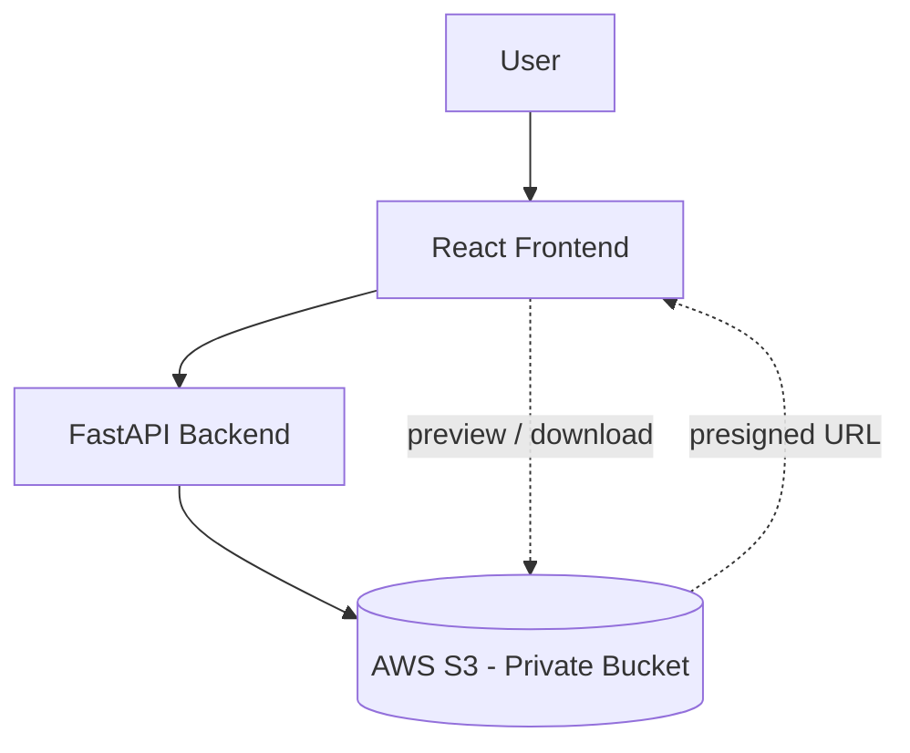

### 5.2 High-Level Data Flow (Automation)

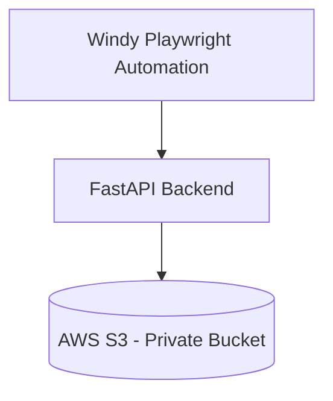

### 5.3 Combined System Context

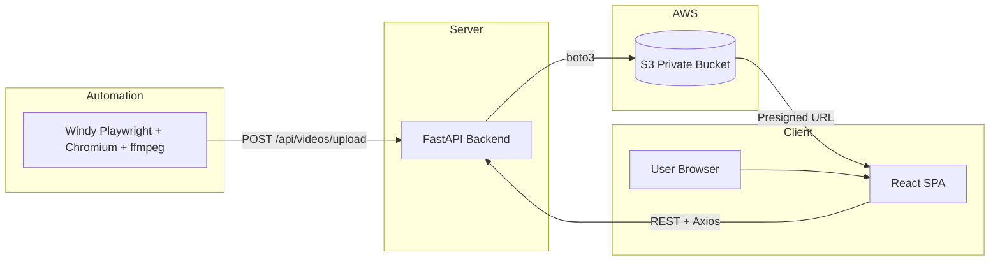

### 5.4 Request Path in Production (Docker)

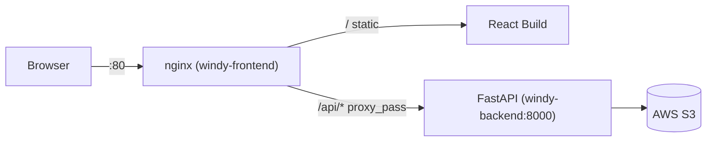

---

## 6. Technology Stack

### 6.1 Frontend

| Technology | Purpose |
|---|---|
| React.js | Component-based UI |
| JavaScript (ES2020+) | Application logic |
| Tailwind CSS | Utility-first styling, design tokens |
| React Router | Client-side routing (`/`, `/documents`) |
| Axios | HTTP client, request/response interceptors |
| Vite | Build tool / dev server |
| lucide-react | Icon set |

### 6.2 Backend

| Technology | Purpose |
|---|---|
| FastAPI | HTTP API framework |
| Python 3.12 | Runtime |
| Pydantic | Schema validation & serialization |
| boto3 | AWS S3 SDK |
| Uvicorn | ASGI server |
| pytest | Automated testing |

### 6.3 Cloud

| Service | Purpose |
|---|---|
| AWS S3 | Object storage — sole persistence layer |
| AWS IAM | Least-privilege credentials for the backend |
| AWS EC2 | Production compute host |
| Presigned URLs | Time-limited, direct browser↔S3 access |

### 6.4 Automation

| Technology | Purpose |
|---|---|
| Playwright | Headless browser automation |
| Chromium | Browser engine driven by Playwright |
| ffmpeg | Trims raw recording to a clean clip |

### 6.5 Deployment

| Technology | Purpose |
|---|---|
| Docker | Containerization of frontend & backend |
| Docker Compose | Multi-container orchestration |
| Nginx | Static file serving + reverse proxy |

### 6.6 Development Tools

| Tool | Purpose |
|---|---|
| Git / GitHub | Version control |
| VS Code | IDE |
| Postman | API testing |

---

## 7. Frontend Architecture

### 7.1 Folder Structure

```
frontend/src/
├── App.jsx                     # Router shell (Navbar + Routes)
├── main.jsx                    # Entry point, BrowserRouter
├── index.css                   # Tailwind entry, design tokens
├── pages/
│   ├── VideoDashboard.jsx      # Route "/"
│   └── Documents.jsx           # Route "/documents"
├── components/
│   ├── Navbar.jsx
│   ├── FilterBar.jsx           # Reused by both pages
│   ├── UploadCard.jsx
│   ├── VideoCard.jsx
│   ├── VideoGroup.jsx
│   ├── VideoLibrary.jsx
│   ├── PreviewModal.jsx
│   ├── document/
│   │   ├── DocumentCard.jsx
│   │   ├── DocumentLibrary.jsx
│   │   ├── DocumentUpload.jsx
│   │   └── DocumentPreviewModal.jsx
│   └── ui/
│       ├── Button.jsx  Card.jsx  Container.jsx
│       ├── Modal.jsx  ProgressBar.jsx  SkeletonCard.jsx
├── hooks/
│   ├── useVideos.js             # list + filter lifecycle
│   ├── useUpload.js             # video upload lifecycle
│   ├── useVideoActions.js       # preview / download side effects
│   └── useDocuments.js          # useDocuments, useDocumentUpload, useDocumentActions
└── services/
    ├── apiClient.js              # shared axios instance
    ├── videoApi.js
    └── documentApi.js
```

### 7.2 Components

- **Presentational primitives** (`ui/`) — Button, Card, Modal, ProgressBar, SkeletonCard, Container. Design-token driven, reused across both modules.
- **Feature components** — `VideoCard`, `VideoGroup`, `DocumentCard` render domain data; no direct API calls.
- **FilterBar** — a single, parameterized component reused by both the Video and Document pages (`dateLabel`, `buttonLabel` props), avoiding duplicated filter UI.

### 7.3 Pages

| Page | Route | Responsibility |
|---|---|---|
| `VideoDashboard` | `/` | Filter bar, upload card, grouped video dashboard |
| `Documents` | `/documents` | Filter bar, document upload, document library |

### 7.4 Hooks (State Management)

The application uses **React hooks only** — no Redux/Context store. Each hook owns one concern:

| Hook | Responsibility |
|---|---|
| `useVideos` / `useDocuments` | Fetch, loading, error, filtered refetch |
| `useUpload` / `useDocumentUpload` | Client-side validation, progress, success/error |
| `useVideoActions` / `useDocumentActions` | Presigned preview URL fetch, download trigger |

### 7.5 Services (API Layer)

`apiClient.js` centralizes the Axios instance, base URL, and response-envelope unwrapping. `videoApi.js` and `documentApi.js` each expose four thin functions (`list`, `upload`, `getPreviewUrl`, `getDownloadUrl`) mapping 1:1 to backend endpoints.

### 7.6 Routing

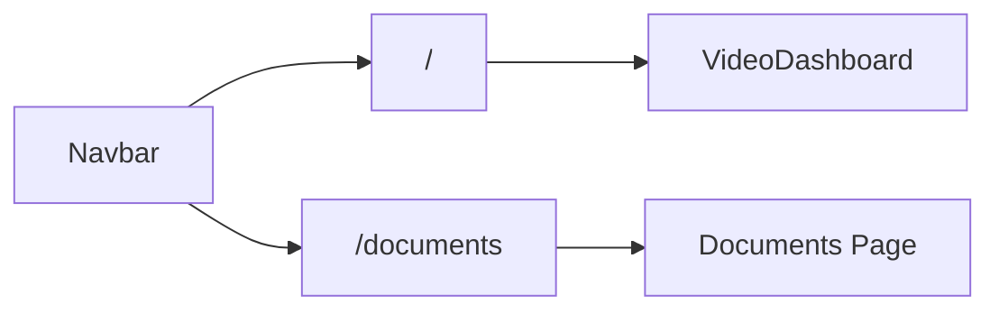

Client-side routing via `react-router-dom`; nginx `try_files` fallback ensures a hard refresh on `/documents` still resolves to `index.html` (no 404).

### 7.7 UI Flow

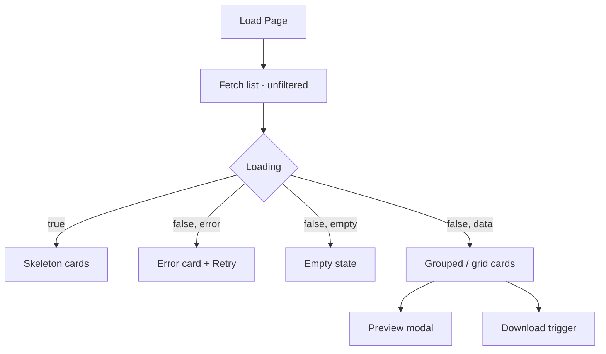

---

## 8. Backend Architecture

### 8.1 Folder Structure

```
backend/app/
├── main.py                     # App bootstrap, CORS, exception handlers, /health
├── config/
│   └── settings.py             # pydantic-settings, env-driven config
├── routes/
│   ├── videos.py                # 4 endpoints
│   └── documents.py             # 4 endpoints
├── services/
│   ├── video_service.py         # business logic
│   └── document_service.py      # business logic
├── aws/
│   └── s3_client.py             # boto3 wrapper (list/upload/head/presign)
├── models/
│   ├── schemas.py                # VideoItem, UploadResult, PresignedUrl
│   └── document_schema.py        # DocumentItem, DocumentUploadResult
└── utils/
    ├── naming.py                 # key building & metadata extraction
    ├── validation.py             # MIME / extension / magic-byte checks
    ├── formatters.py              # size, date formatting
    └── responses.py               # success/error envelope, AppError
```

### 8.2 Layering Principle

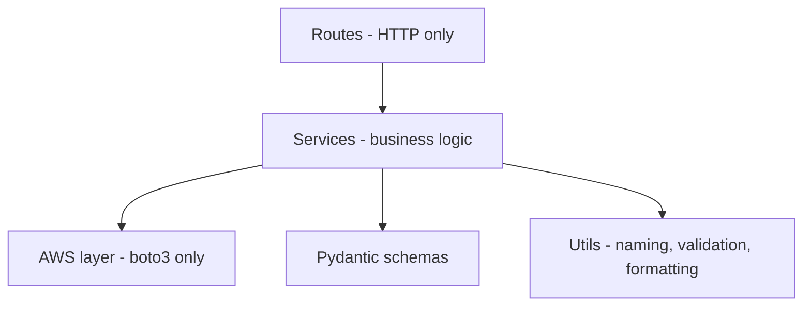

Each layer has one responsibility. Routes never call boto3 directly; the AWS layer never contains business rules.

### 8.3 Routes

Thin HTTP handlers: parse request → call service → wrap in envelope. All errors surface through a single `AppError` exception handler.

### 8.4 Services

Own all business logic: validation ordering, key construction, filtering, metadata mapping, and translation of `botocore` exceptions into safe `AppError`s (no internals leaked to the client).

### 8.5 Utilities

| Module | Responsibility |
|---|---|
| `naming.py` | Sanitize path segments, build unique/structured S3 keys, extract metadata back from a key, guard against path traversal |
| `validation.py` | MIME allowlist, magic-byte sniffing (videos), extension allowlist (documents) |
| `formatters.py` | Human-readable size, ISO date formatting |
| `responses.py` | `{success, data}` / `{success, message}` envelope, `AppError` |

### 8.6 Schemas

Pydantic models define the exact response shape returned inside `data`. Optional metadata fields default to `None`, allowing legacy (non-structured) objects to render gracefully on the frontend.

### 8.7 Validation Strategy

| Check | Videos | Documents |
|---|---|---|
| Filename present | ✅ | ✅ |
| MIME allowlist | ✅ | ✅ |
| Magic-byte content sniff | ✅ (`ftyp`, EBML) | — (extension + MIME sufficient) |
| Extension allowlist | — | ✅ (`.pdf .doc .docx .xls .xlsx .csv .txt`) |
| Non-empty / size cap | ✅ | ✅ |

### 8.8 AWS Integration

`aws/s3_client.py` is the **only** module that imports `boto3`. It exposes four generic operations reused by both modules: `list_objects` (paginated), `upload_fileobj`, `object_exists` (HeadObject), `generate_presigned_get_url`. The client is configured with `signature_version=s3v4` and `addressing_style=virtual` to ensure presigned URLs resolve to the correct **regional** S3 endpoint.

---

## 9. Storage Design (AWS S3)

### 9.1 Why S3 Instead of a Database

| Requirement | S3-Only Approach |
|---|---|
| Store large binary media | Native object storage, no BLOB overhead |
| Metadata (state/plant/date/time) | Encoded directly in the object key — no separate table to keep in sync |
| Durability | 11 nines durability, no backup pipeline to maintain |
| Access control | IAM + presigned URLs, no application-level auth layer needed for read |
| Operational simplicity | Zero database server, zero migrations, zero connection pool |

A database was deliberately omitted: the object key is treated as the **single source of truth**, eliminating drift between metadata records and actual files.

### 9.2 Folder Hierarchy

```
videos/
  <State>/
    <Plant>/
      <RecordingDate>/
        <timestamp>_<uuid>_<originalFilename>.mp4

documents/
  <State>/
    <Plant>/
      <DocumentDate>/
        <YYYYMMDD>_<HHMMSS>_<uuid>_<originalFilename>.<ext>
```

**Example (real object, verified):**
```
videos/MadhyaPradesh/SIRMOUR/2026-07-14/
  20260715T054125Z_733985759da8_SIRMOUR_satellite_2026-07-14_09-31-55_clean.mp4

documents/MadhyaPradesh/SIRMOUR/2026-07-15/
  20260715_113000_60182d0ae6c2_combined_weather_report.txt
```

Legacy (flat) objects — `videos/<unique-name>` with no folder hierarchy — remain fully listable; their metadata fields resolve to `null` and render as `—` in the UI.

### 9.3 Metadata Extraction

No metadata is ever stored outside the key itself.

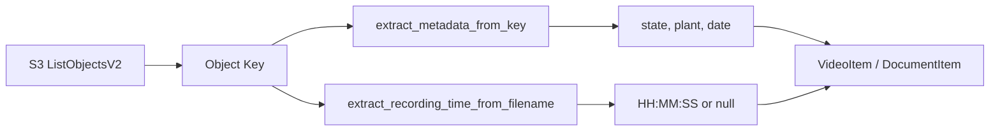

Video `recording_time` is parsed via regex directly from the Windy-generated filename (`..._2026-07-14_09-31-55_clean.mp4`); document `document_time` is embedded at upload time into the unique filename segment (`HHMMSS`) since documents have no equivalent embedded timestamp.

---

## 10. API Documentation

Base envelope for every response:

```json
// success
{ "success": true, "data": { } }
// error
{ "success": false, "message": "..." }
```

### 10.1 Videos

| Method | Endpoint | Description |
|---|---|---|
| `GET` | `/api/videos` | List videos, optional filters: `state`, `plant`, `recording_date` |
| `POST` | `/api/videos/upload` | Multipart upload: `file`, `state`, `plant`, `recording_date` |
| `GET` | `/api/videos/preview?key=` | Presigned **inline** URL (stream) |
| `GET` | `/api/videos/download?key=` | Presigned **attachment** URL |

### 10.2 Documents

| Method | Endpoint | Description |
|---|---|---|
| `GET` | `/api/documents` | List documents, optional filters: `state`, `plant`, `document_date` |
| `POST` | `/api/documents/upload` | Multipart upload: `file`, `state`, `plant`, `document_date`, `document_time` |
| `GET` | `/api/documents/preview?key=` | Presigned **inline** URL |
| `GET` | `/api/documents/download?key=` | Presigned **attachment** URL |

### 10.3 Health

| Method | Endpoint | Description |
|---|---|---|
| `GET` | `/health` | Liveness probe; always 200 regardless of S3 state |

### 10.4 Sample Response — `GET /api/videos`

```json
{
  "success": true,
  "data": [
    {
      "state": "MadhyaPradesh",
      "plant": "SIRMOUR",
      "recording_date": "2026-07-14",
      "recording_time": "09:31:55",
      "filename": "SIRMOUR_satellite_2026-07-14_09-31-55_clean.mp4",
      "upload_date": "2026-07-15T05:41:27+00:00",
      "size": "1.9 MB",
      "s3_path": "s3://bucket/videos/MadhyaPradesh/SIRMOUR/2026-07-14/...clean.mp4",
      "key": "videos/MadhyaPradesh/SIRMOUR/2026-07-14/...clean.mp4"
    }
  ]
}
```

---

## 11. Upload Workflow

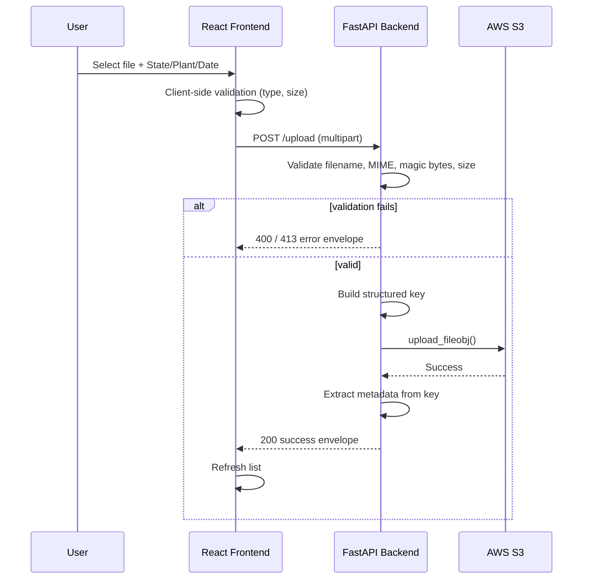

**Step summary**

1. **User** selects a file and metadata (State, Plant, Date[, Time]).
2. **Frontend** performs a friendly client-side check (type/size) — not authoritative.
3. **Backend** receives multipart form data.
4. **Validation** — filename present, MIME allowlist, magic-byte / extension check, size limits. First failure short-circuits with a safe error message.
5. **AWS S3** — object streamed via `upload_fileobj`, structured key built from sanitized metadata + a uuid (guarantees no overwrite).
6. **Response** — backend re-derives metadata from the final key and returns it; frontend refreshes the library.

---

## 12. Windy Automation Workflow

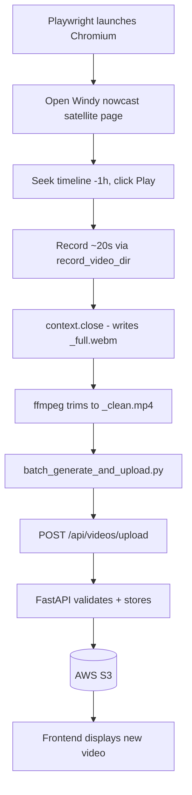

**Step summary**

1. **Playwright** launches headless **Chromium** with Playwright's built-in `record_video_dir`.
2. The automation opens the Windy satellite nowcast layer for the plant's coordinates and starts the animation.
3. Playwright **records the browser tab** for a fixed duration (~20s).
4. **ffmpeg** trims the raw recording, discarding warm-up frames, producing the final clip.
5. A batch runner (`batch_generate_and_upload.py`) iterates every configured site and calls the **Upload API** for each, attaching `state`, `plant`, and `recording_date`.
6. The backend stores the object in **AWS S3** under the structured hierarchy.
7. The video becomes visible on the **frontend** dashboard immediately (next list fetch).

This automation runs entirely outside the web application — it is a producer that talks to the same public upload API a human user would use.

---

## 13. Docker Architecture

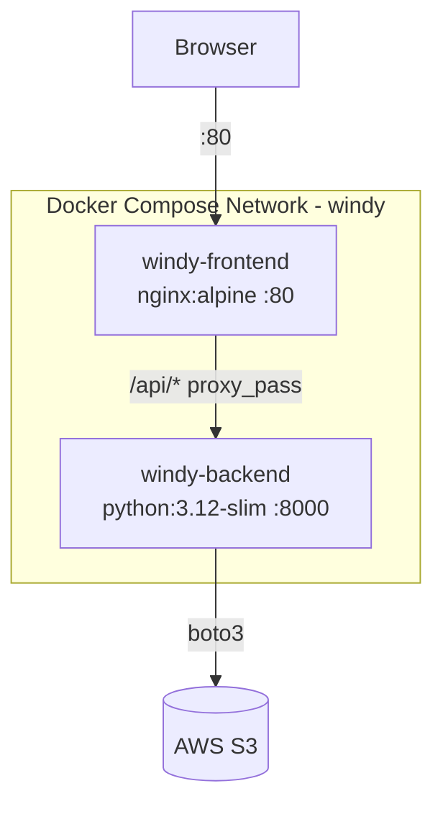

### 13.1 Frontend Container

Multi-stage build:

- **Stage 1** (`node:20-alpine`) — `npm ci`, `npm run build` (Vite production build). `VITE_API_BASE_URL` baked in at build time as `/`.
- **Stage 2** (`nginx:alpine`) — serves the static `dist/` output; `nginx.conf` provides SPA fallback (`try_files ... /index.html`) and reverse-proxies `/api/*` to the backend container.

### 13.2 Backend Container

Single-stage `python:3.12-slim` build. Dependencies installed in a cached layer, application code copied after, runs as a **non-root** user, `HEALTHCHECK` polls `/health`.

### 13.3 Docker Compose

| Service | Build Context | Port | Depends On |
|---|---|---|---|
| `windy-backend` | `./backend` | `8000:8000` | — |
| `windy-frontend` | `./frontend` | `80:80` | `windy-backend` (healthy) |

Both services share a dedicated bridge network (`windy`), allowing nginx to reach the backend by service name (`windy-backend:8000`) — no hardcoded IPs or public URLs.

### 13.4 Nginx Responsibilities

- Serve compiled static assets with long-lived caching.
- SPA fallback routing (prevents 404 on refresh at `/videos`, `/documents`).
- Reverse proxy `/api/*` → backend, same-origin (eliminates CORS in production).

---

## 14. EC2 Deployment Architecture

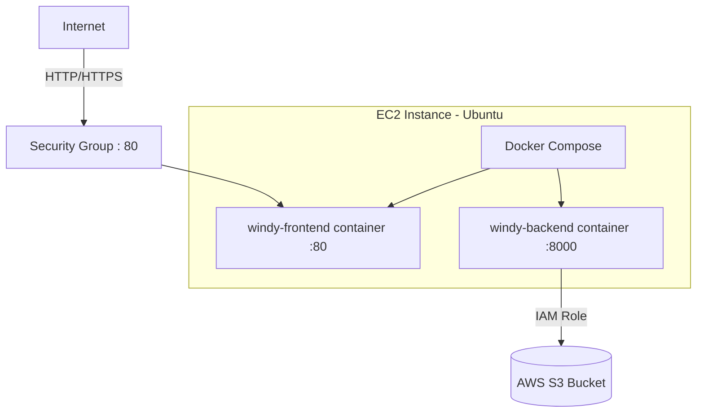

**Deployment steps:**

```bash
git clone <repo> && cd <repo>
cp backend/.env.example backend/.env   # configure AWS_REGION, S3_BUCKET, S3_PREFIX
docker compose build
docker compose up -d
```

Result: two running containers — `windy-backend` (healthy) and `windy-frontend` — reachable on port 80. Production deployments should attach an **IAM role** to the EC2 instance (no static keys) and place an ALB/TLS terminator in front.

---

## 15. Security

| Control | Implementation |
|---|---|
| **IAM** | Backend uses the standard AWS credential provider chain; production relies on an EC2 **IAM role**, not static keys |
| **Private bucket** | Block Public Access enabled at the bucket level; no object is ever public |
| **Presigned URLs** | All reads (preview/download) use short-lived, signed URLs — the browser never receives AWS credentials |
| **Input validation** | Filename, size, and type validated server-side before any S3 call |
| **Content-Type validation** | MIME allowlist checked against the declared `Content-Type` |
| **Magic-byte validation** | Video uploads are sniffed at the byte level (`ftyp`, EBML headers) — a renamed non-video file is rejected even with a spoofed MIME type |
| **Path traversal guard** | `is_key_within_prefix()` rejects any preview/download key outside the app's own prefix before an S3 call is made |
| **Least privilege** | Backend IAM policy scoped to `ListBucket` (prefix-conditioned), `GetObject`, `PutObject` on the specific bucket/prefix only |
| **No secrets in images** | `.env` files excluded via `.dockerignore`; credentials injected at container runtime, never baked into layers |

---

## 16. Folder Structure

```
project-root/
├── docker-compose.yml
├── DEPLOY_DOCKER.md
├── README.md
├── backend/
│   ├── Dockerfile
│   ├── .dockerignore
│   ├── requirements.txt
│   ├── .env.example
│   ├── app/
│   │   ├── main.py
│   │   ├── config/settings.py
│   │   ├── routes/{videos.py, documents.py}
│   │   ├── services/{video_service.py, document_service.py}
│   │   ├── aws/s3_client.py
│   │   ├── models/{schemas.py, document_schema.py}
│   │   └── utils/{naming.py, validation.py, formatters.py, responses.py}
│   └── tests/
└── frontend/
    ├── Dockerfile
    ├── nginx.conf
    ├── .dockerignore
    ├── package.json
    └── src/
        ├── App.jsx, main.jsx
        ├── pages/{VideoDashboard.jsx, Documents.jsx}
        ├── components/ (+ document/, ui/)
        ├── hooks/
        └── services/
```

---

## 17. Screenshots

> Placeholders — insert exported PNG/JPEG screenshots in the final PDF.

**17.1 Home Page**
`[ Screenshot: Home Page ]`

**17.2 Video Dashboard**
`[ Screenshot: Video Dashboard — grouped by Plant and Date ]`

**17.3 Document Dashboard**
`[ Screenshot: Document Dashboard ]`

**17.4 Upload Flow**
`[ Screenshot: Upload form with progress bar ]`

**17.5 Preview Modal**
`[ Screenshot: Video/PDF preview modal ]`

**17.6 Docker Containers**
`[ Screenshot: docker compose ps — both containers healthy ]`

**17.7 AWS S3 Bucket**
`[ Screenshot: S3 console showing videos/ and documents/ hierarchy ]`

---

## 18. Testing

### 18.1 Frontend

- Manual verification of upload, filter, preview, and download flows against the live backend.
- Console-error checks on every route (`/`, `/documents`) after each feature change.
- Responsive verification at desktop, tablet, and mobile breakpoints.

### 18.2 Backend

- **67 automated pytest tests** covering: key naming/uniqueness, metadata extraction (structured + legacy), upload validation (MIME, magic bytes, extension, size), filtering (state/plant/date, combined, empty), presigned URL generation, and key-guard security.
- AWS calls mocked via `monkeypatch` for deterministic, offline test runs.

### 18.3 AWS

- End-to-end verification performed against a **real S3 bucket**: upload → object appears with correct key/Content-Type/size → list returns correct metadata → filter narrows correctly → presigned preview/download return HTTP 200 and stream/save correctly.

### 18.4 Docker

- `docker compose config` validated.
- `docker compose build` — both images build successfully.
- `docker compose up -d` — backend reaches `healthy` before frontend starts (`depends_on: service_healthy`).
- Verified graceful degradation: with AWS credentials absent, `/health` still returns 200; only S3-dependent endpoints return a controlled 502.

---

## 19. Future Enhancements

| Enhancement | Description |
|---|---|
| Authentication | User login (JWT / OAuth) before dashboard access |
| Role-Based Access Control | Separate permissions for viewers vs. uploaders/admins |
| Notifications | Email/Slack alert on new video upload or automation failure |
| Scheduled Uploads | Cron-triggered Windy automation runs (e.g., hourly per site) |
| CloudWatch Logging | Centralized backend logs and metrics in AWS CloudWatch |
| CI/CD Pipeline | GitHub Actions: test → build → push image → deploy on merge |
| Monitoring | Uptime and error-rate dashboards (CloudWatch / Grafana) |
| Object Versioning | S3 versioning to protect against accidental overwrite |

---

## 20. Conclusion

The Windy Video & Document Manager delivers a focused, production-ready pipeline from automated video capture through to secure, filterable retrieval — without the operational overhead of a database. The layered FastAPI backend, a stateless React frontend, and a private S3 bucket organized by a deterministic key hierarchy together form a system that is simple to reason about, straightforward to deploy via Docker Compose, and ready to scale onto EC2 with minimal additional configuration.

---

*End of Document*
